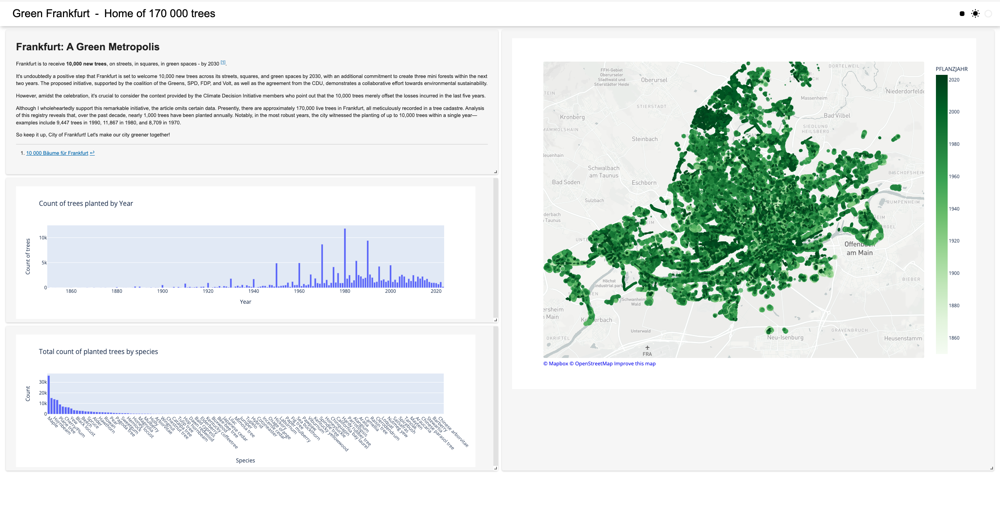

# Frankfurt Tree Cadaster Dashboard

This dashboard is designed to visualize data from the Frankfurt Tree Cadaster using Python with Anaconda Cloud Notebooks. 
It provides an interactive interface to explore information about trees in Frankfurt.

## Instructions

You can either download file from here or use the Anaconda Notebooks sharing functionality and take it from [this link](https://anaconda.cloud/share/notebooks/b9ca8755-e281-4e90-8de0-8be082803308/overview)

If you prefer to download file from here you'd need:
1. Go to the [Anaconda Cloud Notebooks](nb.anaconda.cloud) website.
2. Log in to your Anaconda account or sign up if you don't have one.
3. Upload the ipynb file
4. Select `anaconda-panel-2023.05-py310` kernel in the top right corner of notebook
5. Deploy the notebook as an app by clicking the rocket icon
6. Enjoy the data exploration!

## Dashboard Overview

The dashboard provides the following features:

- Visualization of the distribution of trees in Frankfurt.
- Statistics about tree species.
- Interactive maps showing the location of trees.
- Additional insights into the Frankfurt Tree Cadaster dataset.

## Notes

- Make sure to select the correct kernel as it provides necessary packages to run the code
- Feel free to customize and modify the code to suit your specific needs or to explore the dataset further.

Enjoy exploring the Frankfurt Tree Cadaster Dashboard!
